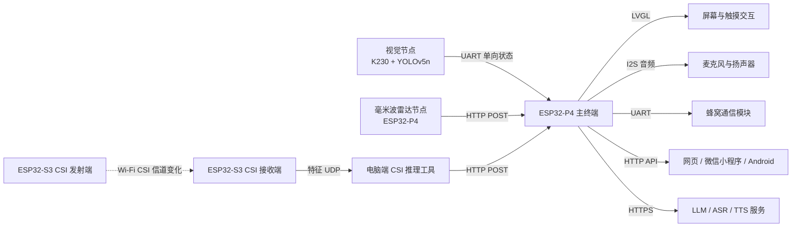

# 基于 ESP32-P4 的多模态 AI 无感健康守护与交互终端系统

面向居家养老、独居老人和家庭健康守护场景的多模态无感监测系统。项目以 ESP32-P4 主终端为数据汇聚和交互中心，融合视觉跌倒检测、毫米波生命体征监测、Wi-Fi CSI 无线感知、语音交互、云端 AI 分析以及电话/短信求助能力，在不要求老人佩戴设备的情况下完成状态感知、风险判断、现场告警和远程查看。

> 本项目曾获**第九届全国大学生嵌入式芯片与系统设计竞赛东部赛区一等奖、全国三等奖（乐鑫赛道）**。

## 项目概览

### 解决的问题

传统手环、胸带等设备需要老人主动佩戴和维护，容易出现忘戴、没电或不适用的问题；单一摄像头方案又容易受到遮挡、光照和隐私因素影响。本项目采用多节点、异构传感器协同的方式，把不同感知手段放在各自擅长的位置：

- **视觉节点**负责识别人体姿态和明显跌倒动作。
- **毫米波雷达节点**负责无接触的人体存在、心率、呼吸率和跌倒辅助判断。
- **Wi-Fi CSI 节点**感知空间信道变化，为遮挡或弱光场景提供辅助证据。
- **ESP32-P4 主终端**负责数据接入、时间门控、融合判断、界面显示、语音交互和告警联动。
- **网页、微信小程序和 Android 客户端**负责远程查看、历史趋势和 AI 健康分析。

### 主要能力

| 能力 | 实现内容 |
| --- | --- |
| 无感生命体征监测 | 展示当前心率、呼吸率、人体存在状态和最近五天历史均值 |
| 多模态跌倒判断 | 视觉与毫米波作为主要证据，Wi-Fi CSI 作为环境辅助证据，并进行数据新鲜度检查 |
| 本地交互 | LVGL 触摸界面、语音唤醒/按住说话、语音播报和现场声光提示 |
| 远程查看 | 主终端通过 HTTP 提供状态与历史数据接口，三端客户端读取同一套数据 |
| AI 健康建议 | 对当前心率、呼吸率、告警状态和环境信息进行简短健康分析与建议 |
| 紧急求助 | 通过蜂窝通信模块执行手动或自动短信、电话告警 |
| 可复现实验 | 提供 CSI 采集、数据清洗、训练、回放和实时推理工具 |

## 系统架构



### 数据流说明

1. 视觉节点周期性输出 `FALL` 或 `NOFALL` 状态，经 UART 单向发送到主终端。
2. 毫米波节点解析雷达数据，得到人体存在、心率、呼吸率和跌倒状态，经 HTTP 上报主终端。
3. 两块 ESP32-S3 组成 CSI 发射/接收链路，接收端提取 CSI 特征并通过 UDP 发送给电脑端工具。
4. 电脑端模型对 CSI 窗口进行推理、平滑和连续确认，再将结果通过 HTTP 上报主终端。
5. 主终端保存每个节点最近一次有效状态及时间戳，执行超时剔除和融合判断。
6. 主终端更新屏幕、历史数据和告警状态，同时向网页、小程序、Android 端提供查询接口。

## 核心技术路线

### 1. 视觉跌倒检测

视觉节点使用自行采集和标注的数据训练 YOLOv5n，并将模型转换为 K230/CanMV 可运行的 `kmodel`。设备端完成图像采集、推理、目标后处理和状态输出，主终端只接收简洁的状态结果，不传输持续视频流，降低通信负担并减少隐私暴露。

视觉节点脚本位于 `vision/k230/fall_detect.py`。由于摄像头存在倒装安装场景，脚本保留图像方向处理和 UART 状态输出逻辑；模型文件和训练数据不随仓库发布。

### 2. 毫米波生命体征与跌倒辅助判断

毫米波节点独立完成雷达串口接收、帧校验、有效数据解析和状态统计。节点不依赖主终端的实时计算，联网后按周期向 `/api/sensor/ld6002c` 发送 JSON，主终端按时间戳判断数据是否仍然有效。

示例数据：

```json
{
  "sensor": "ld6002c",
  "node_id": "ld6002c_01",
  "human": true,
  "heart_rate": 72.0,
  "breath_rate": 16.0,
  "fall_detected": false,
  "state": "normal",
  "frames": 120
}
```

### 3. Wi-Fi CSI 无线感知

CSI 工具链支持从 ESP32-S3 接收端获取 CSI 数据，完成以下处理：

```text
CSI 原始帧
  -> 解析 I/Q 数据
  -> 窗口切分与统计特征提取
  -> 基线校准与动态阈值
  -> RandomForest / ExtraTrees 模型比较
  -> 概率平滑与连续窗口确认
  -> HTTP 上报主终端
```

工具支持“空房、站立、走路、跌倒、坐下、弯腰捡东西”等动作标签，也支持串口采集、UDP 接收和 CSV 回放。CSI 对房间布局、人体位置、天线方向、热点信道和干扰较敏感，因此在系统中承担**辅助确认**角色，不能脱离视觉和毫米波单独作为最终报警依据。

### 4. 多模态融合与告警策略

主终端对视觉、毫米波和 CSI 分别维护有效标志、更新时间、状态和置信信息。融合前执行时间门控：超过新鲜度窗口、解析失败或通信中断的数据不参与当前判断。

当前工程采用面向嵌入式实时运行的证据组合规则：

- 视觉和毫米波是主要证据，CSI 是辅助证据。
- 单个辅助节点异常时，不直接覆盖主要节点的正常结果。
- 主要节点形成明确跌倒证据，且其他有效节点未明确否定时，进入告警确认。
- 连续窗口确认后才锁存告警，避免瞬时噪声触发。
- 告警锁存期间抑制重复拨号和重复短信；状态恢复并满足解除条件后清除锁存。

这套设计将“传感器判断”和“安全告警动作”分离，避免网络抖动、短时误判或某一个节点掉线直接导致错误报警。详细数据流和接口见 [docs/architecture.md](docs/architecture.md)。

### 5. AI 语音交互

主终端的 AI 能力与跌倒安全链路解耦：

- LLM：回答老人关于天气、日期、新闻和日常问题的对话请求。
- ASR：将麦克风采集的语音转换为文本。
- TTS：将 LLM 回复转换为语音并通过扬声器播放。
- AI 建议：根据当前心率、呼吸率、告警状态和天气生成简短健康建议。

LLM、ASR、TTS 均通过 ESP-IDF `menuconfig` 配置 URL、模型、音色和密钥；未配置云端服务时，传感器、屏幕和本地告警链路仍可独立运行。

## 仓库结构

```text
firmware/
  main-terminal/       ESP32-P4 主终端：UI、HTTP、融合、音频、历史数据和告警
  ld6002c-node/        ESP32-P4 毫米波雷达节点：串口解析和 HTTP 上报
  wifi-csi-tx/         ESP32-S3 CSI 发射端
  wifi-csi-rx/         ESP32-S3 CSI 接收端、CSI 特征输出和网络配置

vision/
  k230/                K230 视觉跌倒检测脚本和部署说明

tools/
  csi-toolkit/         CSI 采集、CSV 修复、数据分析、训练、回放和实时推理

clients/
  web-dashboard/       响应式网页端，支持桌面和手机布局
  wechat-miniapp/      微信小程序端
  android/             Kotlin + Jetpack Compose Android 客户端

hardware/
  enclosures/          主终端、雷达节点和 CSI 节点的可打印外壳文件

docs/
  architecture.md      系统架构、数据流和接口说明
  configuration.md      Wi-Fi、节点、云服务和客户端配置说明
```

## HTTP 接口

主终端默认监听 `8090` 端口，并提供跨域响应头，便于网页、小程序和局域网工具访问。

| 方法 | 路径 | 用途 |
| --- | --- | --- |
| `POST` | `/api/sensor/csi` | 接收 CSI 实时推理结果 |
| `POST` | `/api/sensor/ld6002c` | 接收毫米波节点结果 |
| `GET` | `/api/device/status` | 获取当前心率、呼吸率、节点状态和融合告警状态 |
| `GET` | `/api/device/history` | 获取最近五天历史心率、呼吸率数据 |

CSI 上报示例：

```json
{
  "sensor": "esp32_s3_wifi_csi",
  "node_id": "wifi_csi_01",
  "fall_probability": 0.82,
  "smooth_probability": 0.76,
  "threshold": 0.70,
  "alarm": true,
  "state": "疑似跌倒",
  "samples": 250
}
```

主终端返回的数据面向客户端使用，实际字段以 `app_device_agent.c` 和客户端数据适配代码为准。节点地址、端口和上报周期不要写死在公开源码中，应通过 `menuconfig` 或客户端设置配置。

## 快速开始

### 环境要求

- ESP-IDF 5.5.3，Windows 或 Linux 均可。
- Python 3.10 及以上，CSI 工具建议使用独立虚拟环境。
- K230/CanMV 对应的运行时、摄像头驱动和模型转换工具。
- Android Studio、微信开发者工具和现代浏览器，按需使用对应客户端。
- 实际部署时，主终端、毫米波节点、CSI 节点和电脑应处于同一局域网或手机热点网络。

### 编译 ESP-IDF 固件

先打开对应 ESP-IDF 环境，然后分别进入四个固件工程。以下命令以 PowerShell 为例：

```powershell
cd firmware\main-terminal
idf.py set-target esp32p4
idf.py menuconfig
idf.py build
idf.py -p COM5 flash monitor
```

毫米波节点：

```powershell
cd firmware\ld6002c-node
idf.py set-target esp32p4
idf.py menuconfig
idf.py build
idf.py -p COM13 flash monitor
```

CSI 发射端和接收端：

```powershell
cd firmware\wifi-csi-tx
idf.py set-target esp32s3
idf.py menuconfig
idf.py build

cd ..\wifi-csi-rx
idf.py set-target esp32s3
idf.py menuconfig
idf.py build
```

首次使用必须运行 `idf.py menuconfig`，配置 Wi-Fi、主终端地址、节点 ID、串口引脚和云服务参数。不同硬件版本的闪存大小、芯片修订版本和下载端口可能不同，不要直接照搬其他板卡的烧录参数。

### K230 视觉节点

1. 将训练后转换得到的 `yolov5n-falldown.kmodel` 放到设备存储卡的 `/sdcard/kmodel/`。
2. 根据 CanMV 固件版本安装对应的视觉运行时和摄像头驱动。
3. 将 `vision/k230/fall_detect.py` 上传到 K230 并运行。
4. 将 K230 的 UART TX 接到主终端视觉 UART RX，并连接公共 GND。
5. 确认串口输出为 `K230,FALL` 或 `K230,NOFALL`，再进行主终端联调。

模型权重、训练数据和原始比赛资料不包含在仓库中，需要使用者自行训练或准备兼容 K230 的模型文件。

### CSI 采集与训练

```powershell
cd tools\csi-toolkit
python -m venv .venv
.\.venv\Scripts\Activate.ps1
python -m pip install -r requirements.txt
python csi_viewer.py
```

采集流程：

1. 先启动 ESP32-S3 CSI 接收端。
2. 选择串口或 UDP 数据源，确认 CSI 帧持续到达。
3. 选择动作标签并设置固定采集时长。
4. 采集空房、正常活动、弯腰、跌倒等样本，保存为 UTF-8 BOM CSV。
5. 检查每类样本数量、采集位置和动作一致性。
6. 运行训练脚本并用实时 GUI 进行回放验证。

```powershell
python train_csi_model.py
python csi_realtime_gui.py
```

训练脚本会比较 RandomForest 和 ExtraTrees，并保存表现更好的模型。实际部署前应在最终的 AP/STA 拓扑、房间布局、天线位置和人员距离下重新采集数据，不建议直接使用其他房间的模型。

### 网页客户端

```powershell
cd clients\web-dashboard
python -m http.server 8080
```

浏览器打开 `http://127.0.0.1:8080`，在页面中填写主终端地址，例如 `http://192.168.1.100:8090`。网页支持桌面和手机布局，可查看实时生命体征、融合告警、历史数据和节点信息。

网页端的 DeepSeek 健康分析需要用户在页面中配置自己的 API Key。公开部署时不要把密钥长期放在浏览器端，建议改为受控后端代理或企业级密钥管理服务。

### 微信小程序与 Android 客户端

- 微信小程序工程位于 `clients/wechat-miniapp`，使用微信开发者工具打开该目录。
- Android 工程位于 `clients/android`，使用 Android Studio 打开该目录。
- 两端都需要先将设备和手机接入同一网络，再在设置中填写主终端地址。
- 微信开发者工具调试局域网 HTTP 时，需要按开发者工具要求关闭合法域名校验；正式发布应配置 HTTPS 合法域名。
- Android 工程已允许局域网 HTTP 明文访问，正式部署时建议改为 HTTPS 或受控网关。

Android Debug 构建：

```powershell
cd clients\android
.\gradlew.bat assembleDebug
```

## 配置与安全

详细配置见 [docs/configuration.md](docs/configuration.md)，系统数据流见 [docs/architecture.md](docs/architecture.md)。

以下内容不得提交到 Git：

- Wi-Fi SSID 和密码、真实局域网 IP、热点密码。
- LLM、ASR、TTS、天气和 DeepSeek API Key。
- 紧急联系人手机号、蜂窝通信凭据和 Access Token。
- `sdkconfig`、`.env`、模型权重、原始数据集和包含隐私信息的日志。
- 现场演示专用模拟代码、比赛提交材料和本地语音中转服务。

建议使用 `idf.py menuconfig` 写入本地配置，发布前检查 `git status` 和 `git diff --cached`，确认没有密钥、手机号和真实网络参数。

## 测试与已知限制

当前工程已完成以下基础验证：

- ESP32-P4 主终端、毫米波节点使用 ESP-IDF 5.5.3 构建通过。
- ESP32-S3 CSI 发射端和接收端使用 ESP-IDF 5.5.3 构建通过。
- CSI 采集、训练和实时推理脚本可运行。
- 网页、微信小程序和 Android 客户端均保留主终端状态与历史数据接口。

使用时需要注意：

1. 这是健康守护和安全提醒系统，不是医疗器械，心率、呼吸率和跌倒结果不能替代医生诊断。
2. CSI 结果会受到房间布局、无线干扰、人体位置和天线方向影响，必须进行现场校准。
3. 视觉检测受摄像头视野、遮挡、光照和模型训练数据影响。
4. 毫米波雷达需要稳定供电、正确串口电平和合适安装角度。
5. 云端 AI、ASR、TTS 和天气服务依赖网络，未配置或网络中断时不应影响本地传感器和告警链路。
6. 自动电话和短信属于高风险动作，现场部署前应先使用测试号码并配置重复触发抑制。

## 开源范围

本仓库公开可复现的工程代码、客户端、工具、配置模板、架构文档和 3D 打印外壳文件。以下内容不随仓库发布：

- 训练数据集和模型权重。
- 比赛研究报告、答辩材料和现场演示专用页面。
- 本地语音中转服务、真实密钥、手机号和网络配置。
- 第三方 SDK、字体、模型运行时和传感器厂商资料。

使用第三方组件时，请遵守其原始许可证、服务条款和数据保护要求。

## 许可证

本项目代码、文档和硬件外壳文件采用 [MIT License](LICENSE) 发布。第三方 SDK、字体、模型运行时、开发板资料和传感器资料仍以其原始许可证或厂商条款为准。

欢迎通过 Issue 反馈可复现的问题，也欢迎提交围绕传感器适配、数据处理、客户端体验和部署文档的改进建议。
